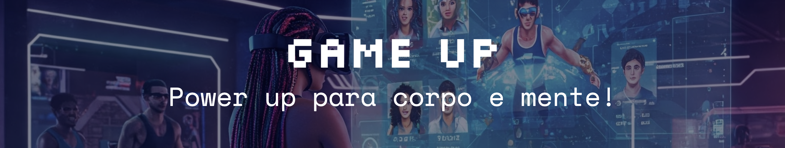

**Game Up** is a gamified workout platform designed to make physical activity more fun and engaging, especially for the geek audience. Inspired by RPG mechanics, the platform features a **class system**, **skills**, and **leveling up**, turning workouts into an adventurous journey full of challenges and progression. Users can choose a class, complete physical activities and level up as they overcome challenges and unlock new abilities — making fitness a more interactive and motivating experience.

---

## Technologies Used

- **HTML5**  
- **CSS3**  
- **JavaScript**  
- **Bootstrap**  
- **Google Fonts**

---

## Features

### Design and Interface  
- **Prototype on Figma:** [View Design](https://www.figma.com/design/E1uWsbk2mEcjPylkt9ljRZ/GAME-UP?node-id=0-1&t=0RoVWniPvoMZJZlB-1)  
- **Color Scheme:** A vibrant palette inspired by geek culture, with tones like blue, purple, lilac, yellow, and green to create a dynamic atmosphere.  
- **Typography:** Pixel art style for headings and clean, readable fonts for body text — maintaining identity without compromising clarity.  
- **Navigation:** Intuitive header with links to navigate between pages, including *Workouts*, *Instructors*, *Plans*, *Gallery*, *Contact*, *Sign In*, and *Sign Up*. The footer contains links to social media profiles, providing easy access to the platform’s social presence.
- **Visual Feedback:** Zoom effects, modals with smooth transitions, and interactive navigation across pages and sections.  
- **Semantic HTML:** Proper use of tags for structure, accessibility, and SEO optimization.  
- **Responsive Design:** Mobile-ready layout that adapts to different screen sizes while preserving usability and aesthetics.
- **Bootstrap:** The project includes Bootstrap locally, rather than relying on an external CDN, providing:
  - **Version Control** to ensure consistent use of a specific Bootstrap version.
  - **Offline Availability** for resilience against network issues.
  - **Faster Load Times** through browser caching on subsequent visits.
---

### Interactive Quiz

A gamified quiz to help users discover which workout class best matches their personality: **Tank**, **Rogue**, **Mage**, or **Survivor**.

- **How It Works:**  
  10 multiple-choice questions. Each answer gives points to a specific class. The class with the highest score is revealed at the end with a detailed description and a recommended workout “build.”

- **Technology:**  
  Built with JavaScript and dynamic DOM manipulation to deliver a smooth and interactive experience.

- **Purpose:**  
  To offer a personalized fitness journey based on the user’s preferences — increasing motivation and engagement.

---

### Project Organization

- **Tool:** [Trello Board](https://trello.com/b/V9JzUceM/game-up)  
- **Backlog:** Contains all tasks needed to complete the project.  
- **Team Members:** Daniel and Laís, with tasks assigned to each member.  
- **Workflow:** Every completed task went through *Testing* (validated by the team leader), then moved to *Done*.  
- **Git:** A dedicated Trello card provides a list of common Git commands (e.g., `git add .`, `git commit -m "message"`, `git push`, etc) to streamline version control for team members during development.

---

### Deploy

-> [Access the live project](https://laisvigas.github.io/Game-Up/html/index.html) <-
